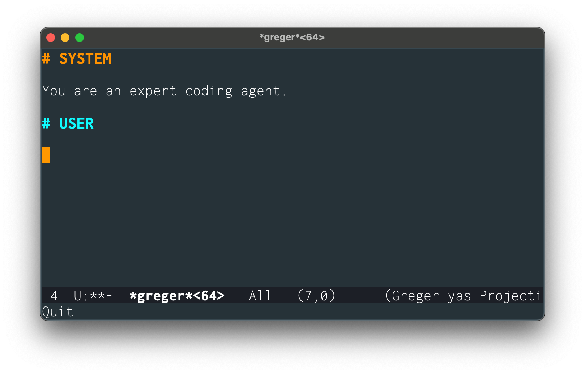
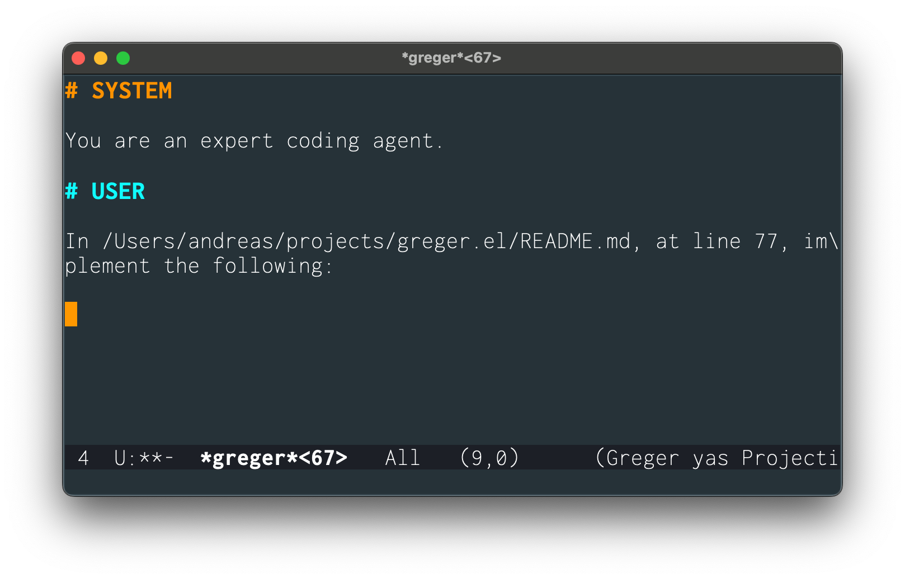
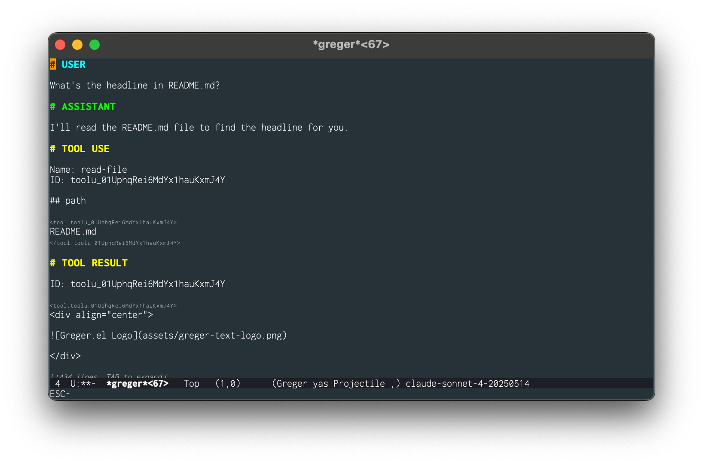
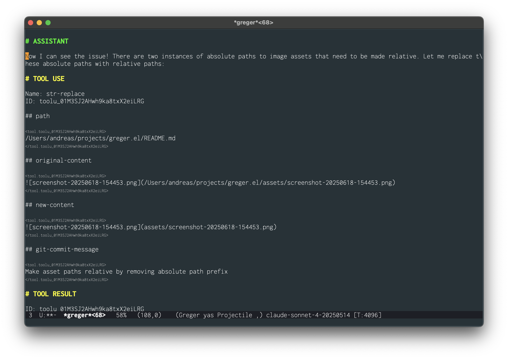
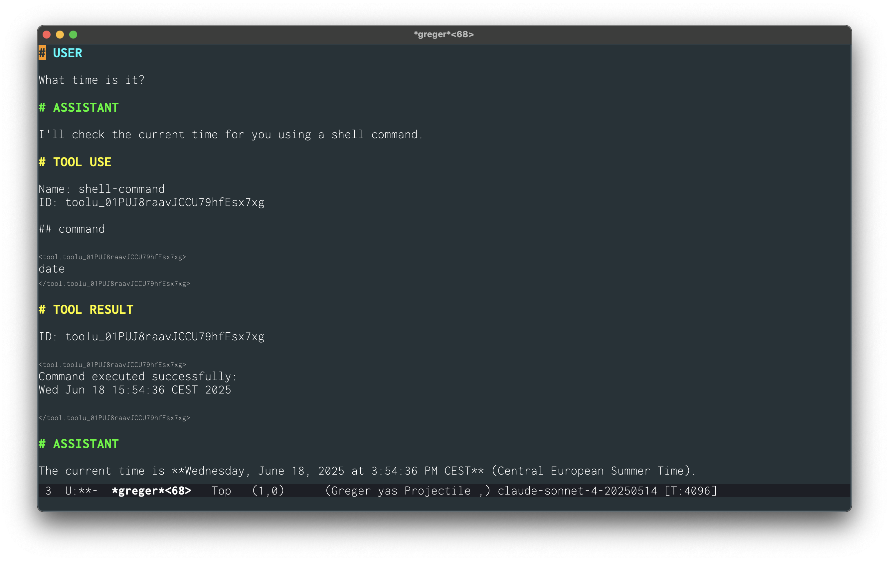
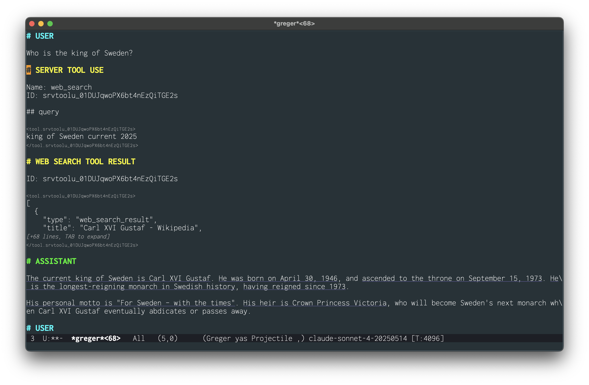

<div align="center">


</div>

# Greger.el - Agentic coding in Emacs

[](https://melpa.org/#/greger) [](https://github.com/andreasjansson/greger.el/actions/workflows/ci.yml) [](https://coveralls.io/github/andreasjansson/greger.el?branch=main)

Greger is a Claude chat interface with tool use. It can read and edit code, download web pages, run shell commands, etc.

## Table of contents


- [Installation](#installation)
- [Usage](#usage)
  - [Keybindings](#keybindings)
- [Features](#features)
  - [Everything is text](#everything-is-text)
  - [Tool use](#tool-use)
  - [All changes tracked in Git](#all-changes-tracked-in-git)
  - [Streaming output](#streaming-output)
  - [Claude caching](#claude-caching)
  - [Available models](#available-models)
  - [No external dependencies (other than `curl`)](#no-external-dependencies-other-than-curl)
  - [Extensive testing](#extensive-testing)
- [Included tools](#included-tools)
  - [Editing tools](#editing-tools)
  - [Filesystem tools](#filesystem-tools)
  - [File search tools](#file-search-tools)
  - [Shell tools](#shell-tools)
  - [Web tools](#web-tools)
- [Build your own tool](#build-your-own-tool)
- [Customization](#customization)
- [Examples](#examples)
- [Why "Greger"?](#why-greger)
- [License](#license)

## Installation

Greger is available from MELPA. To install it, first add MELPA to your package archives by adding this to your init file:

```elisp
(require 'package)
(add-to-list 'package-archives '("melpa" . "https://melpa.org/packages/") t)
(package-initialize)
```

Then refresh your package list and install Greger:

```
M-x package-refresh-contents
M-x package-install RET greger
```

If you use [use-package](https://www.gnu.org/software/emacs/manual/html_node/use-package/), you can install and configure Greger with:

```elisp
(use-package greger
  :ensure t
  :bind ("C-M-;" . greger))
```

This will automatically install Greger from MELPA and set up the recommended keybinding.

### Manual installation

Once installed, just add to your configuration:

``` emacs-lisp
(require 'greger)
```

## Usage

Configure your Claude API key:

```bash
export ANTHROPIC_API_KEY="your-claude-api-key"
```

Or set it in your Emacs configuration:

```elisp
(setenv "ANTHROPIC_API_KEY" "your-claude-api-key")
```

Then start a new Greger session:

```
M-x greger
```



Or start a session with a reference to a particular point in a file:

```
C-u M-x greger
```



The recommended key binding for `greger` is `C-M-;`

```elisp
(global-set-key (kbd "C-M-;") 'greger)
```

### Keybindings

In Greger buffers:

- `M-<return>` - Run agent (`greger-buffer`)
- `C-M-<return>` or `C-u M-<return>`- Run without tools or thinking (`greger-buffer-no-tools`)
- `C-g` - Interrupt tool execution or text generation (`greger-interrupt`)
- `C-; u` - Insert `# USER` tag (`greger-insert-user-tag`)
- `C-; a` - Insert `# ASSISTANT` tag (`greger-insert-assistant-tag`)
- `C-; s` - Insert `# SYSTEM` tag (`greger-insert-system-tag`)
- `C-; m` - Choose Claude model (`greger-set-model`)
- `C-; c` - Copy code block at point (`greger-ui-copy-code`)
- `C-; t` - Toggle thinking off and on (`greger-toggle-thinking`)
- `C-; f` - Toggle follow mode (`greger-toggle-follow-mode`)
- `C-; C-f` - Toggle folding and invisibility (`greger-ui-toggle-folding`)
- `TAB` - When inside a folded code block or citation: toggle folding

## Features

### Everything is text

The full chat history is an editable Emacs buffer.

Greger uses a markdown-inspired syntax:

``` markdown
# SYSTEM

You're a helpful agent.

# USER

Do something

# THINKING

The user wants me to do something.

# ASSISTANT

I'll do something for you.

# TOOL USE

Name: read-file

## path

test.txt

# TOOL RESULT

Hello, world!

# ASSISTANT

The file contains: Hello, world!
```

Font-lock is used to hide a few things (e.g. thinking signatures) but they're still there in the file if you `cat` the file.

This means that **anything in the chat can be edited as text**. You can yank any part of the conversation, undo steps, modify assistant responses, etc. And you can save chats as regular files.

It also means that you can share and let others continue or modify it.

### Tool use

Greger is able to use tools to edit files, run shell commands, search the web, etc. The full set of bundled tools is documented below. You can also give Greger your own custom tools (also documented below).

### All changes tracked in Git

It's easy to get lost when an agent is editing multiple files in quick succession. Or if you're afk while the agent does your work for you.

Therefore Greger commits every change to Git. It means that the Git history can contain lots of commits for relatively minor changes, but it does give you the ability to revert to any previous state.

If the Greger chat is a file that's added to the Git repository, the Greger file will also be committed along with the changes, so you have lineage of the prompts and agent decisions that resulted in each change.

Branching is your friend here -- create a new branch for every new Greger session and keep your pieces of work separate. GitHub lets you squash PRs automatically, which also helps declutter the history.

[Magit](https://magit.vc/) is magic, and makes it really easy to navigate through agent commits.

### Streaming output

Assistant text and thinking is streamed to output. Tool use and tool responses are currently not streamed, but will be in the future

### Claude caching

Greger automatically uses [prompt caching](https://www.anthropic.com/news/prompt-caching). In agentic settings this can save tons of money.

### Available models

Greger supports the latest Claude models:

- **claude-sonnet-4-20250514**
- **claude-opus-4-20250514**

Claude is the only supported model provider at the moment. Others could be added, but right now Claude is the best code LLM.

### No external dependencies (other than `curl`)

Greger should work out of the box on most UNIX systems without having to install external depdencies. The standard `curl` command is used to communicate with the Anthropic API.

### Extensive testing

The Greger test suite has over 150 (unit/integration/end-to-end) tests and >80% test coverage. Not to say there aren't bugs, but it's fairly solid.

## Included tools

Greger comes with a "standard library" of tools. These are the included tools:

### Editing tools

#### `read-file`



Read the contents of a file from the filesystem.

**Parameters:**
- `path` (required): Path to the file to read
- `include-line-numbers` (optional): Whether to include line numbers in the output. Useful when you plan to modify the file
- `start-line` (optional): Starting line number (1-based) to begin reading from
- `end-line` (optional): Ending line number (1-based) to stop reading at (inclusive)

#### `write-new-file`

Write a new file with the given contents. Fails if the file already exists.

**Parameters:**
- `path` (required): Absolute path to the new file
- `contents` (required): Contents to write to the new file
- `git-commit-message` (required): Git commit message for this change

#### `replace-file`

Replace the entire contents of an existing file. Slow but reliable - replaces the complete file contents. Use `str-replace` for targeted changes in larger files.

**Parameters:**
- `path` (required): Path to the file to replace
- `contents` (required): New contents to replace the entire file
- `git-commit-message` (required): Git commit message for this change

#### `str-replace`



This is the real work horse of agentic editing.

Replace a specific string or content block in a file with new content. Finds the exact original content and replaces it with new content. Be extra careful to format the original-content exactly correctly, taking extra care with whitespace and newlines. In addition to replacing strings, str-replace can also be used to prepend, append, or delete contents from a file.

**Parameters:**
- `path` (required): Path to the file to modify
- `original-content` (required): The exact content to find and replace
- `new-content` (required): The new content to replace the original content with
- `git-commit-message` (required): Git commit message for this change
- `replace-all` (optional): If true, replace all instances of original-content. If false (default), replace only the first instance

### Filesystem tools

#### `make-directory`

Recursively create a directory and all parent directories if they don't exist.

**Parameters:**
- `path` (required): Path to the directory to create
- `git-commit-message` (required): Git commit message for this change

#### `rename-file`

Rename or move a file from one path to another.

**Parameters:**
- `old-path` (required): Current path of the file
- `new-path` (required): New path for the file
- `git-commit-message` (required): Git commit message for this change

#### `delete-files`

Delete files and if they're tracked in git, stage the deletion and commit.

**Parameters:**
- `paths` (required): List of file paths to delete
- `git-commit-message` (required): Git commit message for this change

#### `list-directory`

List files and directories in a given directory.

**Parameters:**
- `path` (optional): Path to the directory to list. Defaults to current directory
- `exclude-directories-recursive` (optional): List of directory names to exclude when recursively listing files. Defaults to [".git", "__pycache__"]
- `recursive` (optional): Whether to list files recursively

### File search tools

#### `ripgrep`

Search for patterns in files using ripgrep (rg) command line tool. Note that ripgrep only matches on single lines, so you can't search across multiple lines.

If [Ripgrep](https://github.com/BurntSushi/ripgrep) isn't installed, just tell Greger to install it.

**Parameters:**
- `pattern` (required): The search pattern (regex or literal string). Uses regular expression syntax by default. Meta characters like .(){}*+?[]^$|\\ have special meaning and should be escaped with backslash if you want to match them literally
- `path` (optional): Directory or file path to search in. Directories are searched recursively. Supports glob patterns and respects .gitignore rules by default. Use '.' for current directory
- `case-sensitive` (optional): Whether the search should be case-sensitive
- `file-type` (optional): Restrict search to specific file types using predefined type names. Examples: 'py', 'js', 'md', 'cpp', 'elisp', 'java', 'rust', 'go', 'html', 'css', 'json', 'xml', 'yaml', 'sh', 'sql', 'tex', 'dockerfile'
- `context-lines` (optional): Number of context lines to show around matches (default: 0)
- `fixed-strings` (optional): Treat the pattern as a literal string instead of a regular expression
- `word-regexp` (optional): Only show matches surrounded by word boundaries
- `line-regexp` (optional): Only show matches where the entire line participates in the match
- `max-results` (optional): Maximum number of results to return (default: 50)

### Shell tools

#### `shell-command`



Execute an arbitrary shell command and return the output.

**Parameters:**
- `command` (required): The shell command to execute
- `working-directory` (optional): Directory to run the command in (default: ".")
- `timeout` (optional): Timeout in seconds for command execution (default: 600)
- `enable-environment` (optional): Whether to source shell initialization files (.bashrc, .bash_profile) which may contain secrets and environment variables

If `greger-allow-all-shell-commands` is nil, `shell-command` will prompt for permission before running the command for security.

You can allow-list "safe shell commands" using `<safe-shell-commands>` in the `# SYSTEM` section. For example:

``` markdown
# SYSTEM

You are a helpful agent

<safe-shell-commands>
ls -al
</safe-shell-commands>

# USER

List all files in this directory.
```

### Web tools

#### `web_search`



Search the internet and return up-to-date information from web sources. This is a [server-side tool](https://docs.anthropic.com/en/docs/agents-and-tools/tool-use/web-search-tool) with usage limits.

Hit `TAB` or click on underlined text to see the cited URLs.

**Parameters:**
- `query` (required): Search query

#### `read-webpage`

Read webpage content from a URL. Can return either extracted text or raw HTML.

**Parameters:**
- `url` (required): The URL to read content from
- `extract-text` (optional): Whether to extract text content or return raw HTML (default: true)
- `use-highest-readability` (optional): Whether to use eww's aggressive highest readability setting for better text extraction

## Build your own tool

Greger can use any custom tool you want. It takes three simple steps:

1. Write an emacs lisp function that returns some text
1. Register the tool
1. Add the tool to `greger-tools`

For example, let's say we want a `file-count-lines` tool. First we write our line counting function (naming doesn't matter):

```elisp
(defun count-lines-in-file (filename)
  (with-temp-buffer
    (insert-file-contents filename)
    (count-lines (point-min) (point-max))))
```

Then we register the tool with `greger-register-tool`:

```elisp
(greger-register-tool "file-count-lines"
                      :description "Count the number of lines in a file"
                      :properties '((path . ((type . "string")
                                             (description . "Path to file"))))
                      :required '("path")
                      :function count-lines-in-file)
```

There are lots of tool examples in greger-stdlib.el.

Finally, add the tool to 'greger-tools:

```elisp
(add-to-list 'greger-tools "file-count-lines")
```

## Customization

The following customization options are available:

### `greger-model`
- **Type**: choice (from available models)
- **Default**: `claude-sonnet-4-20250514`
- **Description**: The currently used model.

### `greger-default-system-prompt`
- **Type**: string
- **Default**: `"You are an expert coding agent."`
- **Description**: Default system prompt used for AI interactions.

### `greger-max-tokens`
- **Type**: integer
- **Default**: `32000`
- **Description**: Maximum number of tokens to generate.

### `greger-thinking-budget`
- **Type**: integer
- **Default**: `4096`
- **Description**: Default budget for thinking (internal reasoning) content, in tokens. Set to 0 to disable thinking entirely.

### `greger-allow-all-shell-commands`
- **Type**: boolean
- **Default**: `nil`
- **Description**: Allow all shell commands to run without permission. [May order 4,000 pounds of meat.](https://www.youtube.com/watch?v=m0b_D2JgZgY&t=74s)

### `greger-tools`
- **Type**: repeat symbol
- **Default**: `'("read-file" "write-new-file" "replace-file" "str-replace" "make-directory" "rename-file" "delete-files" "list-directory" "ripgrep" "shell-command" "read-webpage")`
- **Description**: List of tools available to the agent.

### `greger-server-tools`
- **Type**: repeat symbol
- **Default**: `'("web_search")`
- **Description**: List of server tools available to the agent (e.g., web_search).

### `greger-max-iterations`
- **Type**: integer
- **Default**: `100`
- **Description**: Maximum number of agent iterations before stopping.

You can customize all these plus all the colors and fonts with:

```
M-x customize-group
greger
```

## Examples

There are a few examples of Greger chats in the ./examples directory.

## Why "Greger"?

Greger Tragg is a secret cold war agent in The Messenger Must Die by Kjell-Olof Bornemark. He's like a Swedish George Smiley, but he somehow manages to be even more mundane and melancholic and _svårmodig_. The book is a masterpiece.

## License

MIT
